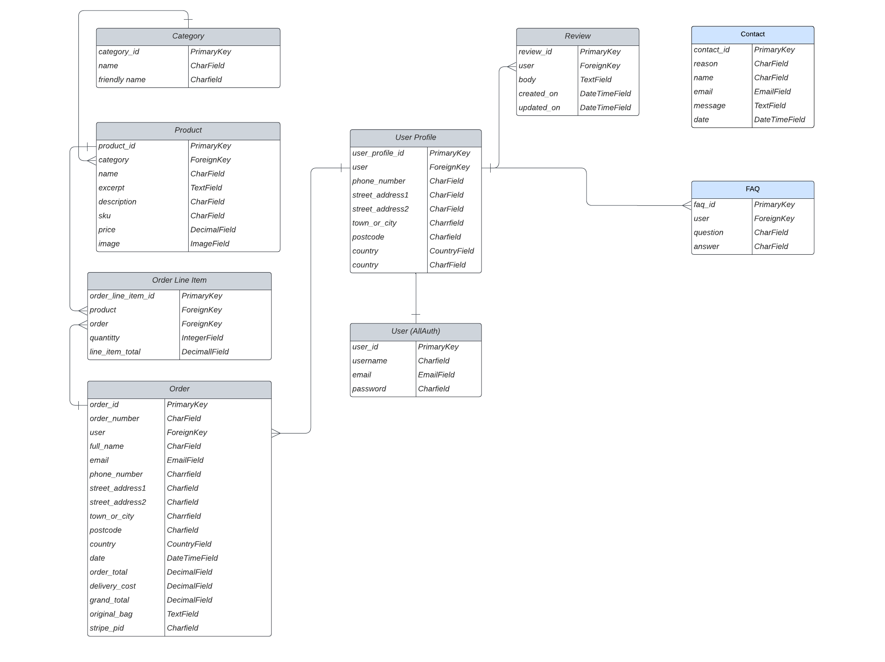

# Lotus

## Project Portfolio 5 - Full Stack Development/Specialization E-commerce

 

## Live Project

[Here]()

---

## Site info

 - Lotus is an application that encourages women to explore 

---

## Table of CONTENTS

* [Project Goals](#project-goals)
  * [User Goals](#user-goals)
  * [Site Owner Goals](#site-owner-goals)

* [User Experience](#user-experience-ux)
  * [Target Audience](#target-audience)
  * [User Requirements and Expectations](#user-requirements-ans-expectations)
  * [User Stories](#user-stories)

* [Technical Design](#technical-design)
  * [Agile Methodology](#agile-methodology)
  * [CRUD Functionality](#crud-functionality)
  * [Database Model](#database-model)
  * [Colour Scheme](#colour-scheme)
  * [Typography](#typography)
  * [Wireframes](#wireframes)

* [Features](#features)
  * [Header](#header)
  * [Footer](#footer)
  * [Home Page](#home-page)
  * [User Account Pages](#user-account-pages)
  * [Profile](#profile)
  * [Vibrator (Products)](vibrator--products)
  * [Product Detail](#product-detail)
  * [Product Management](#product-management)
  * [Bag](#bag)
  * [Checkout](#checkout)
  * [About Us](#about-us)
  * [Reviewss](#reviews)
  * [Contact Form](#contact-form)
  * [Error Pages](#error-pages)
  * [Future Implementations](#future-implementations)

* [Marketing Strategy](#marketing-strategy)
  * [SEO](#seo)
  * [Content marketing](#content-marketing)
  * [Social Media Marketing](#social-media-marketing)
  * [Email Marketing](#email-marketing)

* [Technologies Used](#technologies-used)
  * [Languages Used](#languages-used)
  * [Frameworks, Libraries](#frameworks-libraries)
  * [Storage & Hosting](#storage--hosting)
  * [IDE & Version Control](#ide--version-control)
  * [Other tools](#other-tools)

* [Deployment](#deployment)

* [Testing](#testing)

* [Credits](#credits)
  * [Ressources Used](#ressources-used)
  * [Code Used](#code-used)
  * [Content](#content)
  * [Media](#media)
  * [Acknowledgments](#acknowledgments)

---

## Project Goals

### User Goals

- To be able to purchase hight quality sex toys
- To be able to leave a review about one of the products
- To be able to use CRUD functionality whilst logged onto the site regarding reviews.

### Site Owner Goals

- To provide a platform in which users can discover our collection of vibrators
- To provide an enjoyable user experience which would make users wish to return to the site to purchase 
- To have the ability to be given feedback via a contact form
- To provide users with products that meet their expectations
- To allow users to view, read and comment reviews that may help to other users to make a choice or simply to share their joyful experience with one of the vibrator.
- To allow users to checkout quickly and easily
- To allow users to create a profile to view past orders and update profile information

---

## User Experience (UX)

### Target Audience

- Women who are curious to discover self-pleasure with sex toys
- Women who care about hight quality body safe product
- Women who are sex positivity supporters

User 1: The typical site user would be a female who has an interest in self care and self pleasure in her sexuality.
User 2: Additional site users could be partner of user 1 and may be browsing the site to purchase gifts.

### User Requirements ans Expectations

- A site which provides a good level of interactiveness between users
- Links and functions to act as expected
- Notification to provide feedback on expected function outcomes
- Simple content that a user can easily digest
- Responsiveness to allow pleasant use across devices of different screen sizes

### User Stories

| User Story ID                  | As a/an    | I want to be able to...                                                | So that I can...                                                                  |
| ------------------------------ | ---------- | ---------------------------------------------------------------------- | --------------------------------------------------------------------------------- |
| Viewing and Navigation         |            |                                                                        |                                                                                   |
| 1                              | site user  | intuitively navigate around the site                                   | find content.                                                                     |
| 2                              | site user  | view a list of products                                                | select a product to view.                                                         |
| 3                              | shopper    | click on a product                                                     | read the full product details.                                                    |
| 4                              | shopper    | view a specific category of products                                   | browse the type of products I'm interested in.                                    |
| 5                              | shopper    | search all products                                                    | find what I am looking for.                                                       |
| 6                              | shopper    | sort all products                                                      | view products based on price or title                                             |
| 7                              | site user  | read reviews left by other customers                                   | have feedback insights from custommers                                            |
| Registration and User Accounts |            |                                                                        |                                                                                   |
| 8                              | site user  | register an account                                                    | have a personal account and see my profile                                        |
| 9                              | site user  | login or logout                                                        | access my personal info/keep my account secure.                                   |
| 10                             | site user  | see my login status                                                    | know if I'm logged in or out.                                                     |
| 11                             | site user  | save my personal details in my user profile                            | spare the time to fill them out for future orders.                                |
| 12                             | site user  | have a personalised user profile                                       | with my personal order history and be able to update my default billing address   |
| 13                             | site user  | view my order history                                                  | remember what purchases I've made                                                 |
| 14                             | site user  | recover my password in case I forget                                   | recover access to my account.                                                     |
| Purchasing and Checkout        |            |                                                                        |                                                                                   |
| 15                             | shopper    | add a number of products in different quantities to my shopping bag    | purchase them all at once.                                                        |
| 16                             | shopper    | view a running total of my shopping bag                                | see how much it costs in total.                                                   |
| 17                             | shopper    | view the contents of my shopping bag at any time                       | see what is included and the total cost.                                          |
| 18                             | shopper    | adjust the quantity of individual products in my bag                   | make changes before I purchase.                                                   |
| 19                             | shopper    | see a summary of my shopping cart when I checkout                      | know what products are included and the total cost before I commit to purchasing. |
| 20                             | shopper    | enter my payment information securely                                  | purchase my chosen products quickly with no issues.                               |
| 21                             | shopper    | checkout as a guest                                                    | avoid to sign up for an account.                                                  |
| 22                             | shopper    | view an order confirmation after checkout                              | know my purchase was successful.                                                  |
| 23                             | shopper    | receive an email confirmation of my order                              | have a record of my purchase                                                      |
| Admin & Store Management       |            |                                                                        |                                                                                   |
| 24                             | site owner | add/edit/delete products through an easy-to-use interface              | can manage the store's contents.                                                  |
| Contact                        |            |                                                                        |                                                                                   |
| 25                             | site user  | submit an enquiry form                                                 | report a personal matter                                                          |
| Review                           |            |                                                                        |                                                                                   |
| 26                             | site user  | add / edit / delete a review regarding one of the products in the site | give my feedback.                                                                 |
| Newsletter                     |            |                                                                        |                                                                                   |
| 27                             | site user  | sign up for the website's newsletter                                   | keep myself informed about new products and promotions from the site.             |

---

## Technical Design

### Agile Methodology

- Throughout this project, an agile approach has been applied in order to develop the website. Each activity was broken down into manageable actions from initially  11 milestones/Epic moments, which were then broken down into smaller units : issues. Each issue was labeled to identify their main topics. For instance, the label User Story represents the user experience, the label MPV stands for the Minimum Viable Product which often are associated with the label Must Have.

- Each issue has different acceptance criteria and series of tasks. GitHub's project was used to track these user stories, implement ideas, and monitor the workflow. Indeed, the kanban board allowed the workflow to focus first on the essential features, work in small iteration, adding extra features in case the time allowed it.

- When I was working on the project, I chose one issue to work on from the "Todo" column of the Dashboard Wall of Shame and moved it into the "In Progress" column.
After I finished the issue by fulfilling all the acceptance criteria and the  tasks attached to them, I closed the issue which moved it automatically into the "Done" Column.
The issues that I couldn’t tackle from the "Todo" column ended in the “Won’t do” column.

Issue Samples

---

### CRUD Functionality

 Lotus handles data with full CRUD Functionality. User's prerogatives are :

 #### Review

 | Create | Read | Update | Delete |
 | ------------- | ------------- | -------------    | ------------- |
 |  Yes  | Yes  | Yes | Yes |

 #### Contact

  | Create | Read | Update | Delete |
  | ------------- | ------------- | -------------    | ------------- |
  |  Yes  | No  | No | No |

   #### Product

  | Create | Read | Update | Delete |
  | ------------- | ------------- | -------------    | ------------- |
  |  Yes  | No  | No | No |

  Superser's prerogatives are :

  #### Product

  | Create | Read | Update | Delete |
  | ------------- | ------------- | -------------    | ------------- |
  |  Yes  | Yes  | Yes | Yes |

### Database Model

A backend database was  built with the Django framework and the use of ElephantSQL Postgres for the deployed site.

Database Schema

---

### Colour Scheme

- The Two dominant colors od the website were chosen from pictures of three products

 
Colour Palette

 
 
 
 
 
 
 
 

---

