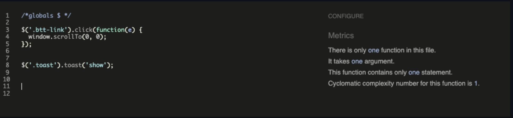
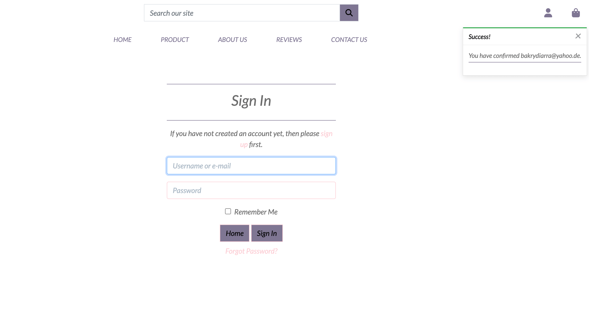
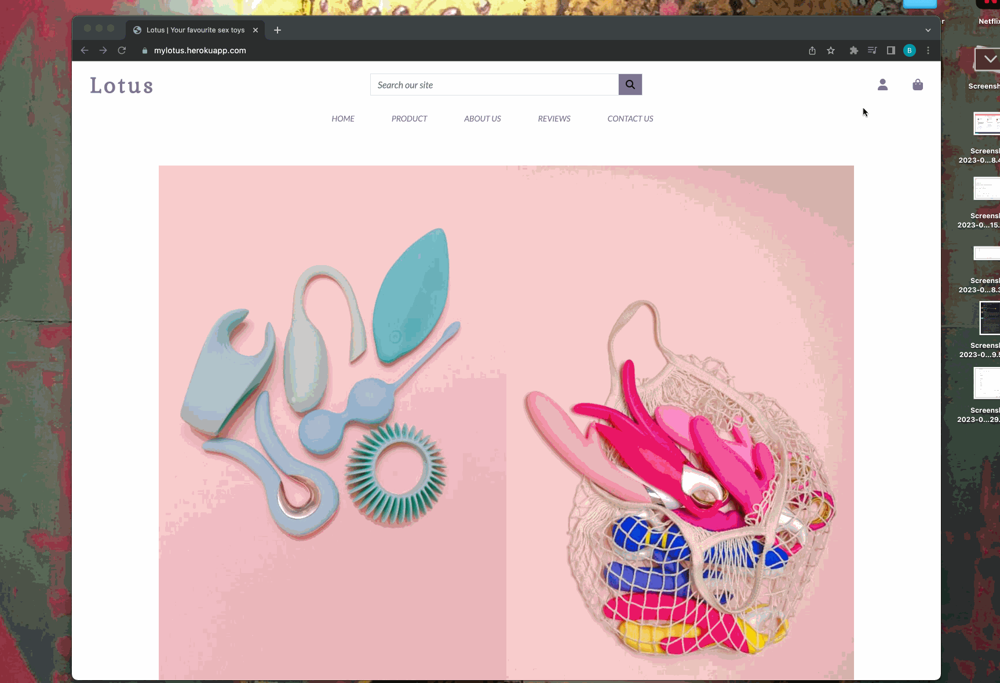

# TESTING

---

## Table of CONTENTS

* [W3C Validator](#w3c-validator)
* [Python Linter](#python-linter)
* [JSHINT](#jshint)
* [Lighthouse](#lighthouse)
* [MANUAL TESTING](#manual-testing)
* [BUGS](#bugs)

---

##  W3C Validator

All HTML pages were run through the W3C HTML Validator. See results in below table.

| Page                           | Logged Out | Logged In |
|--------------------------------|------------|-----------|
| Home                           | No Errors  | No Errors |
| Products                       | No Errors  | No Errors |
| Product Detail                 | No Errors  | No Errors |
| Add Product                    | N/A        |No Errors  |
| Edit Product                   | N/A        | No Errors |
| Bag                            | No Errors  | No Errors |
| Checkout                       | No Errors  | No Errors |
| Checkout Success               | No Errors  | No Errors |
| Profile                        | N/A        | No Errors |
| Order History                  | N/A        | No Errors |
| FAQs                           | No Errors  | No Errors |
| Add FAQ.                       | N/A        | No Errors |
| Edit FAQ.                      | N/A        | No Errors |
| Delete FAQ                     | N/A        | No Errors |
| Reviews                        | No Errors  | No Errors |
| Add Review                     | N/A        | No Errors |
| Edit Review.                   | N/A        | No Errors |
| Delete Review.                 | N/A        | No Errors |
| Contact                        | 10 Erros   | 10 Errors |
| Received msg                   | No Errors  | No Errors |
| Thank Review                   | No Errors  | No Errors |
| Sign In                        | No Errors  | N/A       |
| Sign Up                        | No Errors  | N/A       |
| Log Out                        | N/A        | No Errors |
| Password Reset                 | No Errors  | N/A       |
| 400.html                       | No errors  | No errors |
| 403.html                       | N/A        | No errors |
| 404.html                       | No errors  | No errors |
| 500.html                       | No errors  | No errors |

There was few minor markup errors present on the contact page, it does not significantly impact the user experience. These errors are located within the Django Summernote library and is outwidth my control to edit/correct them.

---

 #### **CSS Validation**

No errors were detected when passing my CSS files through the official W3C CSS Validator

 

base.css

---

 

checkout.css

---

 

profile.css

---

## Python Linter

- The Python code was validated using flakes8 as recommended by the Code Institute. Therefore I opted for running the python linter Flake8 in editor via the CLI with python3.8 -m flake8.
- Any files auto-generated by Django or not written by myself were ignored in terminal output.
- My written code was corrected according the flake 8 standard.

Flake8 results

---

##  JSHINT

All Javascript was passed through Jshint with no issues.

Bag

---

Base

---

Checkout

---

Image selector

---

Products

---

Profile

---

Quantity Input

---

## Lighthouse

 - Overall the results are good. 

Home Page

Product list Page

Product Details Page

 Add Product

Reviews Page

 Edit Review Page

 Add Review age

 Delete Review Page

Checkout Page

Contact Us Page

Bag Page

Profile Page

About us Page

Thank you Page

Signup Page

Signin Page

Logout Page

Rest password Page

## MANUAL TESTING

### Browser Compatibility
  - Testing has been carried out on the following browsers :
  - Safari on macOS Ventura (Safari  Version 13.0.1)
  - Chrome Version Version  Version 108.0.5359.124 
### Test Cases and Results
 - Chrome Developer tools and Mozilla Firefox Web Developer Tools were used throughout the development of the site to test functionality, responsive 
    behaviour, alignment correctness etc:
     - BakckBerry z30
     - BlackBerry PlayBook
     - iPhone SE
     - iPhone XR
     - iPad Air
     - Surface Duo
     - Nest Hub
     - Nest Hub Max
#### Responsive Design

 - The display of the site has been made responsive to allow it to adapt for instance the grid structure layout to a single column.

Demo

</details
---

## Testing the user experience

### Viewing and Navigation & Newsletter

1. As a site user, I want to be able to intuitively navigate around the site so that I can find content.

 - A  fully responsive on different screen sizes navigation bar is visible on every page of the site.

27. As a site user, I want to be able to sign up for the website's newsletter so that I can keep myself informed about new products and promotions from the site.

 - In the footer is a 'Newsletter' section. Here the user can input their email address to sign up.

| Element                 | Action                        | Expected Result                                                          | Pass/Fail |  
| ----------------------- | ----------------------------- | ------------------------------------------------------------------------ | --------- |  
| NavBar                  |                               |                                                                          |           |  
| Site Name/Logo          | Click                         | Redirect to home                                                         | Pass      |  
| Search Box Function     | Enter Text and Click Search   | Search both the product's title and description for a match.             | Pass      |  
| My Account Dropdown     | Click                         | Open profile dropdown                                                    | Pass      |  
| Sign Up Link            | Click                         | Redirect to Sign Up page (Not visible if user in session)                | Pass      |  
| login Link              | Click                         | Redirect to login page (Not visible if user in session)                  | Pass      |  
| Product Management Link | Click                         | Redirect to add_product page (Only visible if superuser in session)      | Pass      |  
| FAQ Management Link     | Click                         | Redirect to add_faq page (Only visible if superuser in session)          | Pass      |  
| My Profile Link         | Click                         | Redirect to user profile page (Only visible if user in session)          | Pass      |  
| Logout Link             | Click                         | Redirect to logout confirm page (Only visible if user in session)        | Pass      |  
| Bag Link                | Click                         | Redirect to bag page                                                     | Pass      |  
| Mobile Top Header       |                               |                                                                          |           |  
| Search Icon Button      | Click                         | Open up search box                                                       | Pass      |  
| Search Box Function     | Enter Text and Click Search   | Search both the product's title and description for a match.             | Pass      |  
| My Account Dropdown     | Click                         | Open profile dropdown                                                    | Pass      |  
| Sign Up Link            | Click                         | Redirect to Sign Up page (Not visible if user in session)                | Pass      |  
| login Link              | Click                         | Redirect to login page (Not visible if user in session)                  | Pass      |  
| Product Management Link | Click                         | Redirect to add_product page (Only visible if superuser in session)      | Pass      |  
| FAQ Management Link     | Click                         | Redirect to add_faq page (Only visible if superuser in session)          | Pass      |  
| My Profile Link         | Click                         | Redirect to user profile page (Only visible if user in session)          | Pass      |  
| Logout Link             | Click                         | Redirect to logout confirm page (Only visible if user in session)        | Pass      |  
| Bag Link                | Click                         | Redirect to bag page                                                     | Pass      |  
| Main Nav                |                               |                                                                          |           |  
| All Products            | Click                         | Redirect all products page                                               | Pass      |  
| Clitoral Vibrator Link  | Click                         | Redirect to prints page filtered to Clitoral Vibrator                    | Pass      |  
| G-spot Vibrator Link    | Click                         | Redirect to prints page filtered to G-spot Vibrator                      | Pass      |  
| Rabbit Vibrator Link    | Click                         | Redirect to prints page filtered to Rabbit Vibrator                      | Pass      |  
| About Us                | Click                         | Redirect to About US Page                                                | Pass      |  
| Contact Link            | Click                         | Open Contact Page                                                        | Pass      |  
| Home Link               | Click                         | Redirect to home (Only displays when screen size reduces to medium size) | Pass      |  
| Reviews Link            | Click                         | Redirect to reviews page                                                 | Pass      |  
| Hamburger Menu          | Responsive                    | Display when screen size reduces to medium size                          | Pass      |  
| Footer                  |                               |                                                                          |           |  
| Social Media Icon Links | Click                         | Open correct location in new tab                                         | Pass      |  
| Newsletter Email field  | Insert incorrect/empty format | On submit: form won't submit                                             | Pass      |  
| Newsletter Email field  | Insert incorrect/empty format | Error message displays                                                   | Pass      |  
| Subscribe Button        | Click                         | Form submit                                                              | Pass      |  
| Subscribe Button        | Click                         | Message appears saying Thank You for subscribing!                        | Pass      |  
| Privacy Policy Link     | Click                         | Open Privacy Policy Page in new tab                                      | Pass      |

Demo

---

3. As a shopper, I want to be able to click on a product so that I can read the full product details.

 - Clicking on an individual product will expose the full product details.

| Element                  | Action                   | Expected Result                                                                              | Pass/Fail |
| ------------------------ | ------------------------ | -------------------------------------------------------------------------------------------- | --------- |
| Product Content          | Display                  | Display correct product image, excerpt, price, product details and dispatch time frame       | Pass      |
| Qty control buttons      | Click                    | Increase/decrease quantity                                                                   | Pass      |
| Qty control buttons      | Click                    | Minus button disabled if quantity is 1                                                       | Pass      |
| Qty control buttons      | Click                    | Plus button disabled if quantity is 99                                                       | Pass      |
| Qty control buttons      | Manually Input <1 or >99 | If quantity >99 or <1 manually entered, error message appears when Add to Bag button clicked | Pass      |
| Keep Shopping button     | Click                    | Redirect to home decor page                                                                  | Pass      |
| Add to bag button        | Click                    | Add item to bag                                                                              | Pass      |
| Add to bag button        | Click                    | Toast Success appears                                                                        | Pass      |
| Add to bag button        | Click                    | Product and quantity visible in toast success                                                | Pass      |
| If Superuser in session: |                          |                                                                                              |           |
| Edit product link        | Click                    | Redirect to edit product page                                                                | Pass      |
| Delete product link      | Click                    | Open delete confirmation page                                                                | Pass      |

Demo

---

2. As a site user, I want to be able to view a list of products so that I can select a product to view.

 - Navigateing to the all products page will display a list of all products from the database.

4. As a shopper, I want to be able to view a specific category of products so that I can browse the type of products I'm interested in.

  - Clicking the 'Product' link in the navbar the dropdown menu will show all the different categories. Clicking any of these will take the user to the products page, showing only items from the category selected. The category chosen will display as the page heading.

5. As a shopper, I want to be able to search all products so that I can find what I am looking for.

 - Entering kerywords in the search bar  box will display any text in the product's title, or description and display the results on the product's page.

6. As a shopper, I want to be able to sort all products so that I can view products based on price or title.

 - A sort by box is located on the products page where users can sort all products by price in ascending or descending order and by title (A-Z) or (Z-A).

| Element               | Action  | Expected Result                                                                                | Pass/Fail |
| --------------------- | ------- | ---------------------------------------------------------------------------------------------- | --------- |
| Sort By' Dropdown     | Click   | Open 'sort by' options                                                                         | Pass      |
| Sort By' Options (x4) | Click   | Re-order products correctly                                                                    | Pass      |
| If Category Selected  | Display | Pages heading changes to show category name                                                    | Pass      |
| Product Number        | Display | Displays correct number of products on page                                                    | Pass      |
| Product Card          | Click   | Redirect to product detail page                                                                | Pass      |
| If Searched Product   | Display | Only display products with search term in either the product's title or description or excerpt | Pass      |
| If Searched Product   | Display | Display number of products found for " searched product"                                       | Pass      |

Demo

---

7. As a site user, I want to be able to read reviews left by other customers so that I can have feedback insights from custommers.

 - Navigationg to the Reviews page, we can discover reviewss left by previous clients. Each review displays the date and the user's name.

| Element            | Action  | Expected Result                                  | Pass/Fail |
| ------------------ | ------- | ------------------------------------------------ | --------- |
| Reviews Content    | Display | Display correct review content, author and date  | Pass      |
| Add Review button  | Click   | Open Add review form                             | Pass      |
| Edit review link   | Display | Only display if user is the author of the review | Pass      |
| Edit review link   | Click   | Redirect to edit review page                     | Pass      |
| Delete review link | Display | Only display if user is the author of the review | Pass      |

Demo

---

7a. As a site user, I want tobe able to  read FAQs left by owner so that I can get more precise information.

 - Navigating to the FAQs page, we can discover the Faqs left by the owner - question/answer

| Element            | Action  | Expected Result                                  | Pass/Fail |
| ------------------ | ------- | ------------------------------------------------ | --------- |
| Faqs Content       | Display | Display correct faqs                             | Pass      |

Demo

---

### Registration and User Accounts

8. As a site user, I want to be able to register an account so that I can have a personal account and see my profile.

 - A sign up button is located in the user options drop down menu in the Navbar. Clicking the button redirect to the sign up page.

10. As a site user, I want to be able to see my login status so that I can know if I'm logged in or out.

 - Whenever a user logs in or logs out a toast message will appear notifying the user or their action.
 - The user name will display in the navbar.

| Element                         | Action                                    | Expected Result                             | Pass/Fail |
| ------------------------------- | ----------------------------------------- | ------------------------------------------- | --------- |
| Sign Up                         |                                           |                                             |           |
| Sign in link                    | Click                                     | Redirect to sign in page                    | Pass      |
| Email field                     | Insert incorrect format                   | On submit: form won't submit                | Pass      |
| Email field                     | Insert incorrect format                   | Error message displays                      | Pass      |
| Email field                     | Insert correct format                     | On submit: form submit                      | Pass      |
| Email field                     | Leave empty                               | On submit: form won't submit                | Pass      |
| Email field                     | Insert duplicate email                    | On submit: form won't submit                | Pass      |
| Email field                     | Insert duplicate email                    | Error message displays                      | Pass      |
| Email Confirmation field        | Insert different email                    | On submit: form won't submit                | Pass      |
| Email Confirmation field        | Insert different email                    | Error message displays                      | Pass      |
| Username field                  | Leave empty/incorrect format              | On submit: form won't submit                | Pass      |
| Username field                  | Leave empty/incorrect format              | Error message displays                      | Pass      |
| Username field                  | Insert correct format                     | On submit: form submit                      | Pass      |
| Username field                  | Insert duplicate username                 | On submit: form won't submit                | Pass      |
| Username field                  | Insert duplicate username                 | Error message displays                      | Pass      |
| Password field                  | Insert incorrect format/length            | On submit: form won't submit                | Pass      |
| Password field                  | Insert incorrect format/length            | Error message displays                      | Pass      |
| Password field                  | Passwords don't match                     | On submit: form won't submit                | Pass      |
| Password field                  | Passwords don't match                     | Error message displays                      | Pass      |
| Password field                  | Insert correct format and passwords match | On submit: form submit                      | Pass      |
| Sign Up button(form valid)      | Click                                     | Form submit                                 | Pass      |
| Sign Up button(form valid)      | Click                                     | Redirect to Verify Email Address page       | Pass      |
| Sign Up button(form valid)      | Click                                     | Alert message confirming email sent appears | Pass      |
| Confirmation Email Confirm Link | Click                                     | Open Confirm Email Address Page             | Pass      |
| Confirm Button                  | Click                                     | Success message confirming new user appears | Pass      |
| Confirm Button                  | Click                                     | Redirect to sign in page                    | Pass      |

Demo

Confirmation Email

---

9. As a site user, I want to be able to login or logout so that I can access my personal info/keep my account secure.

 - Whenever a user logs in or logs out a toast message will appear notifying the user or their action.
 - The user name will display in the navbar.
 - When signed in the options in the user menu will change to show Profile and Log Out buttons.

| Element                         | Action                                    | Expected Result                             | Pass/Fail |
| ------------------------------- | ----------------------------------------- | ------------------------------------------- | --------- |
| Log in                          |                                           |                                             |           |
| Sign up link                    | Click                                     | Redirect to sign up page                    | Pass      |
| Username field                  | Leave empty                               | On submit: form won't submit                | Pass      |
| Username field                  | Leave empty                               | Error message displays                      | Pass      |
| Username field                  | Insert wrong username                     | On submit: form won't submit                | Pass      |
| Username field                  | Insert wrong username                     | Error message displays                      | Pass      |
| Password field                  | Leave empty                               | On submit: form won't submit                | Pass      |
| Password field                  | Leave empty                               | Error message displays                      | Pass      |
| Password field                  | Insert wrong password                     | On submit: form won't submit                | Pass      |
| Password field                  | Insert wrong password                     | Error message displays                      | Pass      |
| Login button(form valid)        | Click                                     | Form submit                                 | Pass      |
| Login button(form valid)        | Click                                     | Redirect to home page                       | Pass      |
| Login button(form valid)        | Click                                     | Success message confirming login appears    | Pass      |
|                                 |                                           |                                             |           |
| Sign Out Confirmation           |                                           |                                             |           |
| Sign Out button                 | Click                                     | Redirect to homepage                        | Pass      |
| Sign Out button                 | Click                                     | Success message confirming Sign Out appears | Pass      |

Demo

---

11. As a site user, I want to be able to save my personal details in my user profile so that I can spare the time to fill them out for future orders.

 - Users can fill in their personal details on their profile page. This information will be prepopulated for any future orders.

12. As a site user, I want to be able to have a personalised user profile so that I can with my personal order history and be able to update my default billing address.
13. As a site user, I want to be able to view my order history so that I can remember what purchases I've made.
 - Once an account has been created and order have been placed, the order history is available on the profile page.
 - Clicking the order number will take you to a summary page of that order.

| Element                | Action            | Expected Result                                                                                                                | Pass/Fail |
| ---------------------- | ----------------- | ------------------------------------------------------------------------------------------------------------------------------ | --------- |
| Open Profile Page      | Access            | If a user tries to access the profile page (by changing the url) without being signed in they are redirected to the login page | Pass      |
| Form fields            | On load           | fields populated with user default info(if previously saved)                                                                   | Pass      |
| All input fields       | Leave blank       | On submit: form submits                                                                                                        | Pass      |
| All input fields       | Just whitespace   | On submit: form submits                                                                                                        | Pass      |
| All input fields       | Fill in correctly | On submit: form submits                                                                                                        | Pass      |
| Form Dropdown          | Click             | Show dropdown options                                                                                                          | Pass      |
| Update button          | Click             | Form submits                                                                                                                   | Pass      |
| Update button          | Click             | Success message appears confirming profile successfully updated                                                                | Pass      |
| Previous order number  | Click             | Redirect to previous order page                                                                                                | Pass      |
|                        |                   |                                                                                                                                |           |
| Previous Order Page    |                   |                                                                                                                                |           |
| Element                | Action            | Expected Result                                                                                                                | Pass/Fail |
| Information Display    | Display           | All previous order information displays correctly                                                                              | Pass      |
| Toast                  | On load           | Previous order info toast appears                                                                                              | Pass      |
| Back to Profile button | Click             | Redirect to profile page                                                                                                       | Pass      |

Demo

---

14. As a site user, I want to be able to recover my password in case I forget so that I can recover access to my account.

 - On the sign-in page, a link to recover your password is located underneath the sign-in button. This uses the AllAuth functionality to reset the user's password.

| Element                         | Action                                    | Expected Result                             | Pass/Fail |
| ------------------------------- | ----------------------------------------- | ------------------------------------------- | --------- |
| Forgot Password Link            | Click                                     | Redirect to Password Reset page             | Pass      |
| Email field                     | Leave empty/incorrect format              | On submit: form submit                      | Pass      |
| Reset My Password Button        | Click                                     | Confirmation message that email sent        | Pass      |
| Password Reset Email Link       | Click                                     | Open Change Password Page                   | Pass      |
| Change Password Button          | Click                                     | Success message confirming Password Changed | Pass      |

Demo

Change Password

Success Password

---

### Purchasing and Checkout

15. As a shopper, I want to be able to add a number of products in different quantities to my shopping bag so that I can purchase them all at once.

 - Within the product detail page the shopper can adjust the quantity by using the buttons located on either side of the input, or by typing in the amount.
 -  Clicking on the add to bag button, the chosen quantity of the product is added to the user's shopping bag.

16. As a shopper, I want to be able to view a running total of my shopping bag so that I can see how much it costs in total.

 - As the user adds products to his bag, a toast message appears in the screen informing the user that the item has been added, giving him a short image of the bag contents and the total cost of the bag.

17. As a shopper, I want to be able to view the contents of my shopping bag at any time so that I can see what is included and the total cost.

 - Clicking on the shopping bag icon in the nav bar redirect to the shopping bag page which shows the products that have added to the bag, unit price, quantity and subtotal.
 - The bottom of the page shows the bag total, delivery costs and then the grand total.

18. As a shopper, I want to be able to adjust the quantity of individual products in my bag so that I can make changes before I purchase.
 - Viewing the shopping bag, the quantity of each product line item can be adjusted and the subtotal updated by clicking the update icon.
 - The user is able to delete the product by clicking the remove button and the bag should be updated accordingly.

| Element                                                      | Action              | Expected Result                                        | Pass/Fail |
| ------------------------------------------------------------ | ------------------- | ------------------------------------------------------ | --------- |
| No Bag Items                                                 |                     |                                                        |           |
| Keep Shopping button                                         | Click               | Redirect to home decor page                            | Pass      |
| Bag Items                                                    |                     |                                                        |           |
| Qty control buttons                                          | Click               | Increase/decrease quantity                             | Pass      |
| Qty control buttons                                          | Click               | Minus button disabled if quantity is 1                 | Pass      |
| Qty control buttons                                          | Click               | Plus button disabled if quantity is 99                 | Pass      |
| Qty control buttons                                          | Manually Input >99  | Error message appears when refresh button is clicked   | Pass      |
| Qty control buttons                                          | Manually Input <1   | Shopping bag is emptied when refresh button is clicked | Pass      |
| Update button                                                | Click               | Update bag item quantity                               | Pass      |
| Update button                                                | Refresh Icon button | Updated confirmation toast appears                     | Pass      |
| Remove button                                                | Click               | Remove item from bag                                   | Pass      |
| Removebutton                                                 | Click               | Removed confirmation toast appears                     | Pass      |
| Line item subtotal / Bag total / Delivery cost / Grand Total | Calculate           | All numbers are calculated correctly                   | Pass      |
| Continue shopping button                                     | Click               | Redirect to products page                              | Pass      |
| Secure Checkout button                                       | Click               | Redirect to checkout page                              | Pass      |

Demo

---

19. As a shopper, I want to be able to see a summary of my shopping cart when I checkout so that I can know what products are included and the total cost before I commit to purchasing.

 - On the Checkout page  a summary the order including a thumbnail image, the product name, the quantity, the unit cost and the overall total order cost on the right-hand side is available.

20. As a shopper, I want to be able to enter my payment information securely so that I can purchase my chosen products quickly with no issues.

 - Navigating to the checkout page, we can find the Stripe Elements UI where the card details can be securely given and pay for the order.
 - The user receives feedback if the card number is valid/invalid.

21. As a shopper, I want to be able to checkout as a guest so that I can avoid to sign up for an account.

 - Shoppers do not need an account to purchase any items. The checkout process remains the same.

22. As a shopper, I want to be able to view an order confirmation after checkout so that I can know my purchase was successful.

 - When the user submits the checkout form, they are redirected to a Checkout Success page where they can see an order confirmation and a summary of their order.

23. As a shopper, I want to be able to receive an email confirmation of my order so that I can have a record of my purchase.

 - When the user has submitted their order they will receive a confirmation email to the email address they entered in their order form containing all the details of the order.

| Element                             | Action                          | Expected Result                                                    | Pass/Fail |
| ----------------------------------- | ------------------------------- | ------------------------------------------------------------------ | --------- |
| Checkout Page                       | Direct URL input (empty bag)    | redirect to products page                                          | Pass      |
| Checkout Page                       | Direct URL input (empty bag)    | empty bag toast appears                                            | Pass      |
| Form fields(if user logged in)      | On load                         | fields populated with user default info(if previously saved)       | Pass      |
| Text Input(if required)             | Leave blank                     | On submit:form won't submit                                        | Pass      |
| Text Input(if required)             | Leave blank                     | error message on invalid field(s)                                  | Pass      |
| Text Input(if required)             | Just whitespace                 | On submit:form won't submit                                        | Pass      |
| Text Input(if required)             | Just whitespace                 | error message on invalid field(s)                                  | Pass      |
| Text Input(if required)             | Fill in correctly               | On submit: form submits                                            | Pass      |
| Phone number Input                  | Leave blank                     | On submit:form won't submit                                        | Pass      |
| Phone number Input                  | Leave blank                     | error message on field                                             | Pass      |
| Phone number Input                  | Just whitespace                 | On submit:form won't submit                                        | Pass      |
| Phone number Input                  | Just whitespace                 | error message on field                                             | Pass      |
| Phone number Input                  | Use non numeric characters      | On submit:form won't submit                                        | Pass      |
| Phone number Input                  | Use non numeric characters      | error message on field                                             | Pass      |
| Email Input                         | Leave blank                     | On submit:form won't submit                                        | Pass      |
| Email Input                         | Leave blank                     | error message on field                                             | Pass      |
| Email Input                         | Just whitespace                 | On submit:form won't submit                                        | Pass      |
| Email Input                         | Just whitespace                 | error message on field                                             | Pass      |
| Email Input                         | Fill in correctly               | On submit: form submits                                            | Pass      |
| Form Dropdown                       | Click                           | Show dropdown options                                              | Pass      |
| Save to profile checkbox            | On load(user logged in)         | Shown                                                              | Pass      |
| Save to profile checkbox            | On load(user not logged in)     | Not shown                                                          | Pass      |
| Save to profile checkbox            | Checked                         | On submit:Delivery information saved to user profile               | Pass      |
| Save to profile checkbox            | Unchecked                       | On submit:Delivery information not saved to user profile           | Pass      |
| Payment card input                  | Input invalid card number       | Error message on field                                             | Pass      |
| Payment card input                  | Input invalid date              | Error message on field                                             |           |
| Adjust Bag button                   | Click                           | Redirect to bag page                                               | Pass      |
| Complete Order button(form invalid) | Click                           | Form won't submit                                                  | Pass      |
| Complete Order button(form invalid) | Click                           | Error message on invalid fields                                    | Pass      |
| Complete Order button(form valid)   | Payment succeeds                | loading screen reappears                                           | Pass      |
| Complete Order button(form valid)   | Payment succeeds                | form submits                                                       | Pass      |
| Complete Order button(form valid)   | Payment succeeds                | redirect to order confirmation page                                | Pass      |
| Complete Order button(form valid)   | (if user logged in)             | order saved to user profile                                        | Pass      |
| Complete Order button(form valid)   | Payment failed                  | Loading animation appears                                          | Pass      |
| Complete Order button(form valid)   | Payment failed                  | form won't submit                                                  | Pass      |
| Complete Order button(form valid)   | Payment failed                  | error message at bottom of form                                    | Pass      |
| Complete Order button(form valid)   | Click                           | Success message appears confirming order successfully processed    | Pass      |
| Complete Order button(form valid)   | Payment Requires authentication | Authentication box appears                                         | Pass      |
| Fail Authentication button          | Click                           | Authentication box closes                                          | Pass      |
| Fail Authentication button          | Click                           | User directed back to form                                         | Pass      |
| Fail Authentication button          | Click                           | error message at bottom of form                                    | Pass      |
| Complete Authentication button      | Click                           | loading screen reappears                                           | Pass      |
| Complete Authentication button      | Click                           | form submits                                                       | Pass      |
| Complete Authentication button      | Click                           | redirect to order confirmation page                                | Pass      |
| Complete Order button(form valid)   | Click                           | Success message appears confirming order successfully processed    | Pass      |
| Complete Order button(form valid)   | Click                           | User receives an order confirmation email with correct information | Pass      |
|                                     |                                 |                                                                    |           |
| Checkout Success Page               |                                 |                                                                    |           |
| Element                             | Action                          | Expected Result                                                    | Pass/Fail |
| Order Confirmation                  | Display                         | Display Correct Order Details                                      | Pass      |
| Keep Shopping! button               | Click                           | Redirect to products page                                          | Pass      |

Demo

---

### Admin & Store Management

24. As a site owner, I want to be able to add/edit/delete products through an easy-to-use interface so that I can can manage the store's contents.

 - For logged-in site owner, a Product Management option appears in the User drop-down menu.
 - The site owner is able to edit and delete products by clicking buttons on both the main Product page and also the product detail page.
 - The edit form is pre-populated with the product information.

| Element                         | Action                | Expected Result                                                                                                            | Pass/Fail |
| ------------------------------- | --------------------- | -------------------------------------------------------------------------------------------------------------------------- | --------- |
| Add Product                     | Access                | If a user tries to add a product (by changing the url) without being signed in they are redirected to the login page       | Pass      |
| Add Product                     | Access                | If a user tries to add a product (by changing the url) without being superuser they are redirected to a custom 403 page    | Pass      |
| Form Text Input (if required)   | Leave blank           | On Submit: Warning appears, form won't submit                                                                              | Pass      |
| Form Text Input (if required)   | Just input whitespace | On Submit: Form won't submit                                                                                               | Pass      |
| SKU                             | Duplicate Entry       | On Submit: Warning appears, form won't submit                                                                              | Pass      |
| Form image select button        | Click                 | Open device storage                                                                                                        | Pass      |
| Form image select button        | Display               | Chosen image name displayed once selected                                                                                  | Pass      |
| Form image select button        | Display               | Default image is used if no image is selected                                                                              | Pass      |
| Cancel button                   | Click                 | Redirect to Home page                                                                                                      | Pass      |
| Add Product button(form valid)  | Click                 | Form submit                                                                                                                | Pass      |
| Add Product button(form valid)  | Click                 | Redirect to Product detail page for new product with all information displaying correctly                                  | Pass      |
| Add Product button(form valid)  | Click                 | Success message appears informing the superuser that the product has been added                                            | Pass      |
|                                 |                       |                                                                                                                            |           |
|                                 |                       |                                                                                                                            |           |
| Edit Product                    |                       |                                                                                                                            |           |
| Element                         | Action                | Expected Result                                                                                                            | Pass/Fail |
| Edit Product                    | Access                | If a user tries to add a product (by changing the url) without being signed in they are redirected to the login page       | Pass      |
| Edit Product                    | Access                | If a user tries to add a product (by changing the url) without being superuser they are redirected to a custom 403 page    | Pass      |
| Edit Product Form               | Display               | Form has all the fields filled out with the original content                                                               | Pass      |
| Edit Product Form               | Image Field           | Thumbnail of original image is shown                                                                                       | Pass      |
| Form Text Input (if required)   | Leave blank           | On Submit: Warning appears, form won't submit                                                                              | Pass      |
| Form Text Input (if required)   | Just input whitespace | On Submit: Form won't submit                                                                                               | Pass      |
| Cancel button                   | Click                 | Redirect to Home page                                                                                                      | Pass      |
| Submit button(form valid)       | Click                 | Form submit                                                                                                                | Pass      |
| Edit Product button(form valid) | Click                 | Redirect to Product detail page for new product with all information displaying correctly                                  | Pass      |
| Edit Product button(form valid) | Click                 | Success message appears informing the superuser that the product has been updated                                          | Pass      |
|                                 |                       |                                                                                                                            |           |
| Confirm Delete Product          | Action                | Expected Result                                                                                                            | Pass/Fail |
| Delete Product                  | Access                | If a user tries to Delete a product (by changing the url) without being signed in they are redirected to the login page    | Pass      |
| Delete Product                  | Access                | If a user tries to Delete a product (by changing the url) without being superuser they are redirected to a custom 403 page | Pass      |
| Delete                          | Click                 | Redirect to product page                                                                                                      | Pass      |

Demo

---

24a. As a site owner, I want to be able to add/edit/delete faq so that I can give more informations to the website visitors. 

- For logged-in site owner, a Faq Management option appears in the User drop-down menu.
- The site owner is able to edit and delete each faq by clicking delete or edit button.
- The edit form is pre-populated with the product information.

| Element                         | Action                | Expected Result                                                                                                            | Pass/Fail |
| ------------------------------- | --------------------- | -------------------------------------------------------------------------------------------------------------------------- | --------- |
| Add Faq                         | Access                | If a user tries to add a product (by changing the url) without being signed in they are redirected to the login page       | Pass      |
| Add Faq                         | Access                | If a user tries to add a product (by changing the url) without being superuser they are redirected to a custom 403 page    | Pass      |
| Form Text Input (if required)   | Leave blank           | On Submit: Warning appears, form won't submit                                                                              | Pass      |
| Form Text Input (if required)   | Just input whitespace | On Submit: Form won't submit                                                                                               | Pass      |
| Cancel button                   | Click                 | Redirect to FAQs page                                                                                                      | Pass      |
| Add Faq button(form valid)      | Click                 | Form submit                                                                                                                | Pass      |
| Add Faq button(form valid)      | Click                 | Redirect to Faqs page                                                                                                      | Pass      |
|                                 |                       |                                                                                                                            |           |
| Edit Faq                        |                       |                                                                                                                            |           |
| Element                         | Action                | Expected Result                                                                                                            | Pass/Fail |
| Edit Faq                        | Access                | If a user tries to add a product (by changing the url) without being signed in they are redirected to the login page       | Pass      |
| Edit Faq                        | Access                | If a user tries to add a product (by changing the url) without being superuser they are redirected to a custom 403 page    | Pass      |
| Edit Fag Form                   | Display               | Form has all the fields filled out with the original content                                                               | Pass      |
| Form Text Input (if required)   | Leave blank           | On Submit: Warning appears, form won't submit                                                                              | Pass      |
| Form Text Input (if required)   | Just input whitespace | On Submit: Form won't submit                                                                                               | Pass      |
| Cancel button                   | Click                 | Redirect to Faq page                                                                                                       | Pass      |
| Submit button(form valid)       | Click                 | Form submit                                                                                                                | Pass      |
| Edit Faq button(form valid)     | Click                 | Redirect to Faqs page                                                                                                      | Pass      |
|                                 |                       |                                                                                                                            |           |
| Confirm Delete Product          | Action                | Expected Result                                                                                                            | Pass/Fail |
| Delete Faq                      | Access                | If a user tries to Delete a product (by changing the url) without being signed in they are redirected to the login page    | Pass      |
| Delete Faq                      | Access                | If a user tries to Delete a product (by changing the url) without being superuser they are redirected to a custom 403 page | Pass      |
| Delete                          | Click                 | Redirect to Faq page                                                                                                      | Pass      |

Demo

---

### Contact

25. As a site user, I want to be able to submit an enquiry form so that I can report a personal matter

- Clicking on the "Contact Us" link a contact form is displayed.
- The user can select the type of enquiry from a drop-down menu.
- If the user is logged in, their email address is prepopulated.
- When the form is submitted, the user is redirected to a thank you page and receives an email confirmation.

| Element                       | Action                | Expected Result                                                                     | Pass/Fail |
| ----------------------------- | --------------------- | ----------------------------------------------------------------------------------- | --------- |
| Form Text Input (if required) | Leave blank           | On Submit: Warning appears, form won't submit                                       | Pass      |
| Form Text Input (if required) | Just input whitespace | On Submit: Warning appears Form won't submit                                        | Pass      |
| Email Input                   | User Logged In        | Email Field pre populated with user email address                                   | Pass      |
| Email Input                   | Incorrect Format      | On Submit: Warning appears, form won't submit                                       | Pass      |
| Enquiry Type Dropdown         | Click                 | Display all Enquiry Types in Database                                               | Pass      |
| Cancel button                 | Click                 | Redirect to Home page                                                               | Pass      |
| Submit button(form valid)     | Click                 | Form submit                                                                         | Pass      |
| Submit button(form valid)     | Click                 | Redirect to home Page                                                               | Pass      |
| Submit button(form valid)     | Click                 | Thank you message page appears                                                      | Pass      |
| Submit button(form valid)     | Click                 | User receives confirmation email about their enquiry                                | Pass      |

Demo

---

### Review

26. As a site user, I want to be able to add / edit / delete a review regarding one of the products in the site so that I can give my feedback.

- Logged-in user clicks on the "Add Review" button on th Reviews page, they can see a form where they can add a new Review to the site. If the user is not logged-in a message will invite him to register in order to post a review.
- The user is able to edit and delete their own reviewss from buttons on the Reviews Page.
- The edit forms fields are pre-populated with review information.

| Add Review                     |                       |                                                                                                                        |           |
| ------------------------------ | --------------------- | ---------------------------------------------------------------------------------------------------------------------- | --------- |
| Element                        | Action                | Expected Result                                                                                                        | Pass/Fail |
| Add Review                     | Access                | If a user tries to add a review (by changing the url) without being signed in they are redirected to the login page    | Pass      |
| Form Text Input (if required)  | Leave blank           | On Submit: Warning appears, form won't submit                                                                          | Pass      |
| Form Text Input (if required)  | Just input whitespace | On Submit: Form won't submit                                                                                           | Pass      |
| Cancel button                  | Click                 | Redirect to Reviews page                                                                                               |           |
| Add Review button(form valid)  | Click                 | Form submit                                                                                                            | Pass      |
| Add Review button(form valid)  | Click                 | Redirect to Reviews Page with all information displaying correctly                                                     | Pass      |
| Add Review button(form valid)  | Click                 | Thank you page appears informing the user that the Review has been added                                               | Pass      |
|                                |                       |                                                                                                                        |           |
|                                |                       |                                                                                                                        |           |
| Edit Review.                   |                       |                                                                                                                        |           |
| Element                        | Action                | Expected Result                                                                                                        | Pass/Fail |
| Edit Review                    | Access                | If a user tries to edit a Review (by changing the url) without being signed in they are redirected to the login page   | Pass      |
| Edit Review                    | Access                | If a user tries to edit another user's Review (by changing the url) they are redirected to a custom 403 page           | Pass      |
| Edit Review Form               | Display               | Form has all the fields filled out with the original content                                                           | Pass      |
| Form Text Input (if required)  | Leave blank           | On Submit: Warning appears, form won't submit                                                                          | Pass      |
| Form Text Input (if required)  | Just input whitespace | On Submit: Form won't submit                                                                                           | Pass      |
| Cancel button                  | Click                 | Redirect to Reviews page                                                                                               |           |
| Submit button(form valid)      | Click                 | Form submit                                                                                                            | Pass      |
| Edit Review button(form valid) | Click                 | Redirect to Reviews Page with all information displaying correctly                                                     | Pass      |
| Edit Review button(form valid) | Click                 | Success page appears informing the user that the review has been edited                                                | Pass      |
|                                |                       |                                                                                                                        |           |
|                                |                       |                                                                                                                        |           |
| Confirm Delete Review          |                       |                                                                                                                        |           |
| Element                        | Action                | Expected Result                                                                                                        | Pass/Fail |
| Delete Review                  | Access                | If a user tries to delete a Review (by changing the url) without being signed in they are redirected to the login page | Pass      |
| Delete Review                  | Access                | If a user tries to delete another user's Review (by changing the url) they are redirected to a custom 403 page         | Pass      |
| Confirm Delete - cancel button | Click                 | Redirect to Reviews page                                                                                               | Pass      |
| Confirm Delete - delete button | Click                 | Delete Review from database                                                                                            | Pass      |

Demo

---

## BUGS

During the project I encountered a number of minor bugs, most of them resulted from mispelling mistakes, case sensitiveness or carless erros during coding such identations.

| Bug           | Fix           |
| ------------- | ------------- |
| Django urls not working | While I was working on the contact app. I couldn't render the template for contact due to a missing directoy patterns. Once added, it worked. |
| delivery cost wasn't render in the checkout | once the identaton was fixed. I could render the cost delivery|
| problem to update total cost |  once the identaton was fixed. I could render the update total cost|
| few undefined variables | Once I imported the import or assign value the variables. It worked pefectly |

Sample erros

---

[Back to README.md](README.md)